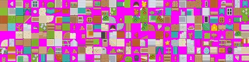

# MCIGraph Library

The minimalistic graphics library used in the programming 2 course at MCI. The actual library itself is just the `mcigraph.hpp` file which is a header only library for ease of use.

An example of how to use it can be seen in `mandelbrot.cpp`. The folder `templates` contains a pre-made project for Code::Blocks.

The library supports Linux, MacOS, and Windows, as it is based on [raylib](https://www.raylib.com/).

Tiles that can be used for creating games are found in the `tiles` folder and `tiles_orig.zip` archive. The archive contains the original `*.bmp`-images with a magenta background to show transparency, which wore converted to `*.png` in the `tiles` folder 

For a more in-depth description of the library see the slides about this topic.
