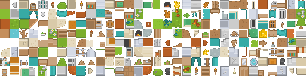

# MCIGraph Library
The minimalistic graphics library used in the **Programming 2** course at MCI. The actual library itself is just the `mcigraph.hpp` file which is a header only library for ease of use that wraps [raylib 5.0](https://www.raylib.com/) in a convenient manner for an introductory course.

As the underlying graphics library is raylib, it is cross-platform with support for Linux, MacOS and Windows. Web support is available through emscripten, though has not been tested with the MCIGraph library.

## How to use
An example of how to use it can be seen in `mandelbrot.cpp`. You can compile it with the following command:

```bash
g++ -o .\mandelbrot.exe .\mandelbrot.cpp -Wall -std=c++17 -O3 -I ./thirdparty/raylib-5.0/src -L ./thirdparty/raylib-5.0/src -lraylib -lgdi32 -lwinmm -lopengl32 -lpthread
```

## Tiles
This MCIGraph is setup to be used for creating tile based games. A tileset that can be used for creating games can be found in the `tiles` folder and `tiles_orig.zip` archive.
The archive contains the original `*.bmp`-images with a magenta background to show transparency, which wore converted to `*.png` in the `tiles` folder



## History
MCIGraph was originally created with SDL2 as a backend, though this has made it fairly difficult for many students to adapt to their needs. The usage of raylib was an improvement with that regard.